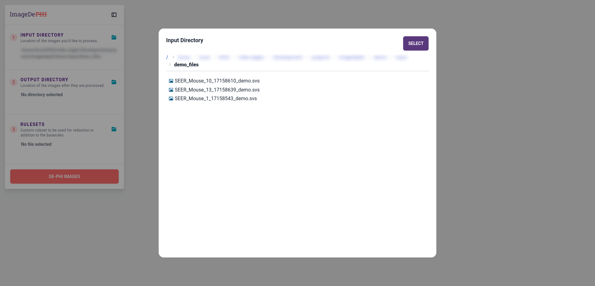

# Image DePHI Demo

This walkthrough will guide you through using the Image DePHI program.

## Getting the demo data

In order to get the demo data, you will need to have installed Image DePHI and run the following command:

```bash
imagedephi demo-data
```

This will create a new directory in the location it is run called `demo_files` and download several whole slide images into that directory. These images contain fake PHI, which we will redact with Image DePHI.

## Redacting with the Graphical User Interface (GUI)
Image DePHI allows redaction of whole slide images through either a graphical user interface, accessible through a web browser, or a command line interface. First, let's take a look at the readaction workflow using the graphical user interface.

#### 1. Starting the program
In order to start the program, install Image DePHI and run:

```bash
imagedephi gui
```

This will start the program, which will be accessible at a random port, and open up a browser at the correct address.

By default, this command will select a random port to serve the application from. You can specify a port if you'd like by using the `--port` flag, e.g:

```bash
imagedephi gui --port 8888
```

#### 2. Looking at the UI
If your browser is not already open to Image DePHI, open up your browser and go to `127.0.0.1:<port>` where `<port>` is either the random port picked by the command above or the number you supplied to the `--port` flag if you used that option to start the server.


You should be greeted by the initial UI screen. On the left hand side there are several options for specifying which files should be redacted and how they should be redacted. We will go over each step individually.

#### 3. Select Files to be Redacted

The first thing you'll need to do is select files for redaction.


Click the button in Step 1 to open up a file browser.


Navigate your computer's file system until you come to the directory where you downloaded your demo files, then click "Select."

#### 4. Select Output Destination

Next, select a location for redacted images. Image DePHI does not modify your original images. Instead, it creates new, redacted images saved into the location selected here.


For this demo, select the directory that is the parent of your `demo_files/` directory. A new directory will be created at this location for the redacted images.

#### 5. Preview Redaction Changes

After selecting your input directory, you will see a table previewing the redaction that is about to happen. For each file in the input directory, you'll see a row containing the file name, a thumbnail, the redaction status, and the metadata tags.

Looking at the metadata tags, you'll see that, for example, the "Date" tag is red with strikethrough. This indicates that this field will be removed and not present in the redacted output file. Scrolling over, you'll see tags like "AppMag" and "BitsPerSample" have no special styling, indicating that they will be included in the output file.

Most importantly, you'll see that there's an issue in the "Redaction Status" column for the image "SEER_Mouse_1_17158543_demo.svs". If you hover over the red icon you'll see the message "1 tag(s) missing redaction rules." Below that you'll see "55500: 55500," indicating that this image contains a metadata tag with the number "55500" that Image DePHI doesn't know how to redact.


#### 6. Creating a Custom Rule Set

The base rule set provided by Image DePHI is used every time images are redacted. User-defined rule sets can be used to supplement or modify the behavior defined by the base rules.

The base rule set does not contain a rule for tag `55500`, so in order to redact the demo images, the program will need to be supplied a ruleset that knows what to do with tag `55500`.

Let's create that ruleset now. Create a new file called `custom_rules.yaml` and add the following:

```yaml
---
name: Custom Rules
description: Custom ruleset used for the Image DePHI demo.
svs:
    metadata:
        '55500':
            action: delete
```

If you'd like to know the default behavior of Image DePHI, take a look at the [base rules](../imagedephi/base_rules.yaml).

#### 7. Using Your Custom Ruleset

Now that you've created a rule to complete redaction of the demo images, let's use that rule set.

Click the folder icon in Step 3 (Rulesets) to open the file navigator.


Navigate to the custom rule set you created in step 6 and select it. The rule set you select in this step will be composed with the base rule set provided by Image DePHI. If a tag appears in both the base rules and the custom rule set, the custom rule will be applied instead of the base rule.

The table should update to reflect that the program now knows how to redact tag `55500`, and each image should have a green checkmark icon in the "Redaction Status" column.


#### 8. Redact the Demo Images

All that's left to do is click redact! Click the button that says "De-PHI Images." You'll see a progress bar that indicates how much time is left in the redaction process.


Once that succeeds, you'll see a toast notification at the bottom of the screen indicating that the images have been redacted successfully.


You'll find a new directory in the location you selected as your output directory. This new directory will have a name starting with "Redacted_" and ending with a timestamp of when you started redacting images. It will contain redacted images. Adjacent to that directory will be a manifest file mapping input file names to output file names. If there were any issues during redaction, those would be reported in the manifest file as well.

## Using the CLI

Here is one example of a workflow to redact images using only CLI commands.

#### 1. Use the `plan` command to see if there are any missing rules

```bash
imagedephi plan demo-data
```

#### 2. Create an override rule set

#### 3. Add the missing rule

#### 4. Use the `plan` command with the override rule set

#### 5. Use the `run` command to redact the images

#### 6. Inspect the manifest

#### 7. Skip renaming/use a custom name


